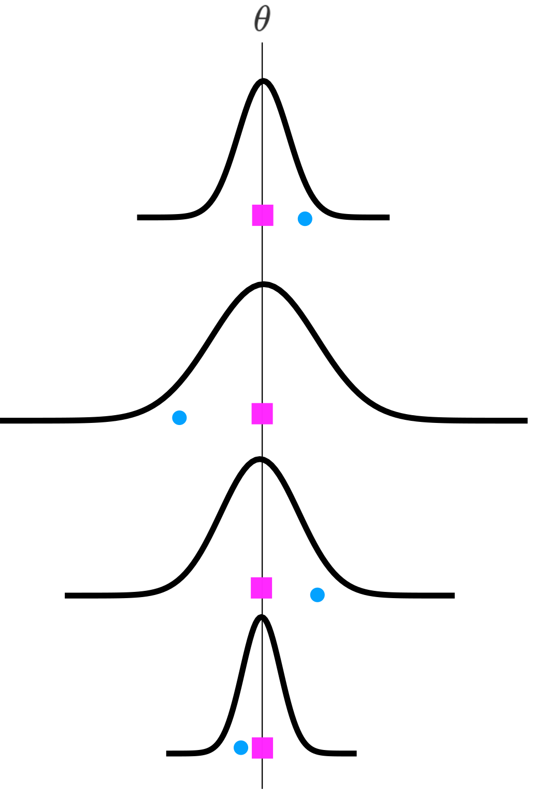

```{r setup, include=FALSE}
options(htmltools.dir.version = FALSE)
knitr::opts_chunk$set(echo = FALSE,
                      #cache = TRUE,
                      fig.align = "center",
                      fig.retina = 3,
                      dpi = 300,
                      warning = FALSE,
                      message = FALSE, 
                      fig.width = 10)
```

```{r packages}
devtools::load_all()
library(tidyverse)
library(here)
library(kableExtra)
library(RefManageR)
library(flextable)
```

```{r loading-data, echo = FALSE}
dat_meta <- read_rds(here("objects", "dat_meta.rds"))
dat_meta_post <- read_rds(here("objects", "dat_meta_post.rds"))
dat_sens <- read_rds(here("objects", "dat_sens.rds"))
paper_objects <- read_rds(here("objects", "paper_objects.rds"))
```

```{r functions}
format_qm_stat <- function(fit){
    qm_stat <- get_qm_stat(fit)

    if(length(qm_stat$QMdf) < 2){
        sprintf("($\\chi^2_{%s} = %s, %s$)", qm_stat$QMdf, qm_stat$QM, qm_stat$QMp)
    }else{
        sprintf("($\\F_{%s,%s} = %s, %s$)", qm_stat$QMdf[1], qm_stat$QMdf[2], qm_stat$QM, qm_stat$QMp)
    }
}

filename = stringr::str_replace(knitr::current_input(), ".Rmd", "")
```

```{r reference}
BibOptions(check.entries = FALSE,
           bib.style = "authoryear",
           cite.style = "alphabetic",
           style = "markdown",
           hyperlink = FALSE,
           dashed = FALSE)
myBib <- ReadBib("files/ref.bib", check = FALSE)
```

```{r extra}
xaringanExtra::use_panelset()
```

class: title-slide, center, middle

.title[Multivariate Meta-analysis in the Multiverse 🚀] 
</br>
</br>
</br>
.author[Chiara Montuori, Filippo Gambarota, Gianmarco Altoè and Barbara Arfè]
</br>
</br>
</br>
</br>
</br>
</br>
</br>
.event[University of Padova @Psicostat]
</br>
.event[04/03/2022]

```{r, out.width="10%"}

```

---
# Outline

<br/>

- ## Meta-analysis in 2 minutes 😱🕐

<br/>

- ## The main problems

<br/>

- ## Our modelling choice

<br/>

- ## Our multiverse approach 🚀

<br/>

- ## Reference and useful links

---
class: inverse, center, middle

# Meta-analysis in 2 minutes 😱🕐

---
# 1. Changing the statistical unit

When we do a meta-analysis we are **switching the statistical unit** from e.g. participants to studies with multiple participants

--

```{r}
knitr::include_graphics("img/statistical-unit.svg")
```

---
class: white-bg

# 2. Summarizing with Effect Sizes

Usually (but not always) we use a standardized effect size measure (e.g., Cohen's *d* or Pearson Correlation) in order to compare studies with different designs, dependent measure (e.g., Accuracy and Reaction Times)

.pull-left[

Cohen's *d*

```{r}
ggplot(data = data.frame(x = c(-3, 3)), aes(x)) +
    geom_area(stat = "function",
              fun = dnorm,
              fill = "grey",
              alpha = 0.3,
              args = list(mean = 0, sd = 1)) +
    geom_area(stat = "function",
              fun = dnorm,
              fill = "salmon",
              alpha = 0.3,
              args = list(mean = 0.5, sd = 1)) +
    geom_segment(aes(x = 0, xend = 0, y = 0, yend = dnorm(0, 0, 1)),
                 linetype= "dashed",
                 alpha = 0.3) +
    geom_segment(aes(x = 0.5, xend = 0.5, y = 0, yend = dnorm(0.5, 0.5, 1)),
                 linetype= "dashed",
                 alpha = 0.3) +
    annotate("text", x = 0.25, y = 0.43, label="d = 0.5", size = 7) +
    xlim(-3.5, 4.5) +
    theme_minimal(base_size = 27) +
    xlab("Cohen's d") +
    theme(axis.text.y = element_blank(),
          axis.title.y = element_blank())
```

]

.pull-right[

Correlation

```{r}
set.seed(2022)
x <- runif(100, -1, 1)
y = scale(x) * 0.2 + rnorm(100)

qplot(x, y) +
    coord_fixed(ratio = 0.3) +
    theme_minimal(base_size = 27) +
    annotate("text", x = -0.8, y = 2.5, label = paste("rho ==", round(cor(x,y), 2)),
             parse = TRUE,
             size = 7) +
    geom_smooth(method = "lm", se = FALSE)

```

]

---
class: white-bg

# 3. Weighting by precision

In order do a meta-analysis we need to pool together multiple studies taking into account that some studies should have more weight (e.g., higher sample size). In the simplest form, a meta-analysis is essentially a weighted average.

```{r}
set.seed(2022)
dat <- tibble(
    es = rnorm(20, 0.5, 0.5),
    sei = runif(20, 0, 1),
    id = factor(1:20)
)

fit <- metafor::rma(es, sei = sei, data = dat, method = "REML")

```

```{r, out.width="80%"}

ggplot(dat) +
    aes(x = es, y = id) +
    geom_point(size = 3) +
    xlim(min(dat$es) -0.5, max(dat$es)+0.5) +
    cowplot::theme_minimal_grid() +
    geom_vline(xintercept = mean(dat$es),
               linetype = "dashed") +
    ylab("Study") +
    xlab("Effect Size")

```

---
class: white-bg

# 3. Weighting by precision

In order do a meta-analysis we need to pool together multiple studies taking into account that some studies should have more weight (e.g., higher sample size). In the simplest form, a meta-analysis is essentially a weighted average.

```{r, out.width="80%"}
    
ggplot(dat) +
    aes(x = es, y = id) +
    geom_point(aes(size = 1/sei),
               show.legend = FALSE) +
    xlim(min(dat$es) -0.5, max(dat$es)+0.5) +
    cowplot::theme_minimal_grid() +
    geom_vline(xintercept = mean(fit$b),
               linetype = "dashed",
               col = "grey") +
    geom_vline(xintercept = mean(dat$es),
               linetype = "dashed",
               col = "red") +
    ylab("Study") +
    xlab("Effect Size")
```

---
# 4. Fixed effect vs Random effect

This is an essential (*and often misunderstood*) step:

--

.pull-left[

The **fixed-effect** model assume a single **population-level** effect/parameter to be estimated $\theta_{fixed}$. Observed variability between effects is due to **sampling error** only.

```{r, out.width="70%"}

```

]

--

.pull-right[

The **random-effect** model assume a distribution of **population-level** effects where the **true effect can vary**. We need to estimate the mean $\theta_{random}$ and the variance $\tau^2$

```{r, out.width="70%"}

```

]

---
# 5. Complex data structure

In some situations we need to take into account multilevel and/or multivariate situations:

- multiple studies within the same paper (multilevel structure)
- multiple effects (dependent variables) measured on the same pool of participants (e.g., Accuracy and Reaction Times)

--

```{r}
knitr::include_graphics("img/data-structure.svg")
```

---
class: inverse, center, middle

# The present work

---
# Coding and Executive Functions

The impact of **coding training** on children (~5-10 age) executive functions (**outcomes**). We selected only **randomized-control trials**.

<br/>

```{r}
knitr::include_graphics("img/research-design.svg")
```

---
# First problem: **Effect size**

For PPC designs one of the mostly used effect size is the $dpcc$ by Morris (2008). In particular the $dpcc_2$:

</br>

$$d_{pcc_2} = c_p \frac{(M_{T,post} - M_{T,pre}) - (M_{C,post} - M_{C,pre})}{SD_{pooled,pre}}$$

</br>

With sampling variance:

</br>

$$\sigma^2(d_{pcc_2}) = c^2_p(1-\rho)(\frac{n_t+n_c}{n_t n_c})(\frac{n_t+n_c-2}{n_t+n_c-4})(\frac{1 + \Delta^2}{2(1-\rho)(\frac{n_t+n_c}{n_t n_c})})$$

</br>

The critical component is the $\rho$ i.e. the **pre-post** correlation that is often **not reported**!

---
# Second problem: **Multiple Effect Sizes**

When measuring a certain cognitive function (e.g., **working memory**) different authors could use different measures. We decided to recode the **raw** test measure $y_1, y_2,...y_n$ into the **latent** psychological variable $y_i$. This create a situation where we have multiple $y_i$ on the same paper.

Borenstein et al. (2009) and also the `metafor` package with the `metafor::aggregate.escalc()` function implemented a way to combine multiple dependent effect sizes:

</br>

.pull-left[

```{r, out.width="90%"}

```

]

.pull-right[

```{r, out.width="90%"}

```

]

---

# Third problem: **Multiple Outcomes**

This is the classical **multivariate situation** where we need to take into account the correlation between different measures on the same pool of participants:

</br>

```{r}

```

--

We need this matrix for each study, creating a **huge** variance-covariance matrix. But most importantly we need the **covariance between effects**!

---
# Fourth problem: **Limited amount of studies**

Often, for new area of research or not really widespread research topics the amount of available studies is limited. In particular according to our **strict** inclusion criteria we found **9 papers** with several effects within each paper:

--

```{r}
dat_meta$data_agg[[1]] %>% 
    group_by(outcome2) %>% 
    count() %>% 
    rename("Outcome" = outcome2) %>% 
    kbl() %>% 
    kable_styling(bootstrap_options = c("striped", "condensed"),
                  full_width = FALSE)
```

---
# Why is a problem?

--

Depending on the model we need to estimate **one or several parameters**:

- Williams et al. (2018) clearly demonstraed the biased estimation of $\tau$ with a limited amount of studies impacting also the estimation of $\mu$ especially using the classical DerSimonian and Laird (1986) or REML estimators.
- With a multivariate model we estimate several $\mu$ and, in case of the random-effect model, several $\tau$

```{r, out.width="80%", fig.cap="Simulated sampling distribution of Tau from Williams et al. (2018)"}

```

---
class: inverse, center, middle

# Our solution? ...a Multiverse approach! 🚀

---
# Why multiverse?

```{r, out.width="80%"}

```

```{r, out.width="80%"}

```

---
# Why multiverse?

<br/>
<br/>
<br/>
<br/>

.blockquote[
We suggest that instead of performing only one analysis, researchers could perform a multiverse analysis [...] A multiverse analysis offers an idea of **how much the conclusions change because of arbitrary choices in data construction** and gives pointers as to **which choices are most consequential** in the fragility of the result.
]

---
# Our choice...Fixed-effect multivariate model!

Following the notation from Mavridis and Salanti (2013):

$$\begin{pmatrix}
y_{i1} \\
\vdots \\
y_{ij}
\end{pmatrix} \sim MVN \Bigg(
\begin{pmatrix}
\mu_{i1} \\
\vdots \\
\mu_{ij}
\end{pmatrix},
\begin{pmatrix}
\sigma^2_{i1} & \dots & \sigma_{i1,ij}\\
\vdots & \ddots & \vdots\\
\sigma_{i1,ij} & \dots & \sigma^2_{ij}\\
\end{pmatrix}\Bigg)$$

Where each study $y_i$ can have multiple outcomes $j$ and come from a multivariate normal distribution with means the vector of effects and the variance-covariance matrix.

--

- Estimating an effect size for each outcome (as series of univariate analysis)
- No $\tau$ estimation (compared to the random-effect model)
- Takes into account the multivariate data structure (compared to univariate or multilevel analysis)
- More appropriate with a limited amount of studies (see Cai & Fan, 2020)

---

# But our Multiverse...

- Fixed-effect or random-effect Model?
- Multivariate or Univariate?
- Which correlations to use?
    - A $\rho_{pre-post}$ of 0.5, 0.7 and 0.9
    - A $\rho_{agg}$ of 0.3, 0.5, 0.7
    - A $\rho_{multi}$ of 0.3, 0.5 and 0.7
    
We have a total of `r 3*3*3*4` meta-analysis to compute!

--

```{r, out.extra='style="border: none;"'}
knitr::include_url("https://giphy.com/embed/75ZaxapnyMp2w",
                   height = 300)
```

---
class: inverse, center, middle

# The main results...

---
# The main results...

<br/>
<br/>

```{r}
paper_objects$model_table %>% knitr::knit_print()
```

---
class: clear

# The main results...

<br/>
<br/>

```{r, out.width="80%"}
paper_objects$forest_multi
```

---
class: inverse, center, middle

# Our multiverse results!

---
class: clear, full-image

.panelset[

<!-- BEGIN PANEL -->

.panel[.panel-name[Cognitive Flexibility]

```{r, out.width="90%"}
dat_sens$plot_sens_estimate[[1]] + theme(title = element_blank())
```

]

.panel[.panel-name[Inhibition]

```{r out.width="90%"} 
dat_sens$plot_sens_estimate[[2]] + theme(title = element_blank())
```

]

.panel[.panel-name[Planning]

```{r out.width="90%"}
dat_sens$plot_sens_estimate[[3]] + theme(title = element_blank())
```

]

.panel[.panel-name[Problem Solving]

```{r out.width="90%"}
dat_sens$plot_sens_estimate[[4]] + theme(title = element_blank())
```

]

.panel[.panel-name[Working Memory]

```{r out.width="90%"}
dat_sens$plot_sens_estimate[[5]] + theme(title = element_blank())
```

]

<!-- END PANEL -->
]

---
class: inverse, center, middle

# Take Home Message

---

# Take Home Message

<br/>
<br/>

--

.blockquote[Data analysis is not **easy** and **cannot be oversimplified**. You have to take into account complex data structures and statistical dependence]

<br/>
<br/>

--

.blockquote[You are **always** making a specific choice from **multiverse** of possibilities in terms of statistical models, values to impute, etc.]

<br/>
<br/>

--

.blockquote[
Doing one analysis is **FINE**. Doing Multiple analyses is **FUN** (and **useful ** 😉)
]

---
class: title-slide, center, middle

.email[`r icons::fontawesome$solid$envelope` [filippo.gambarota@phd.unipd.it](mailto:filippo.gambarota@gmail.com)]
<br/>
<br/>
<br/>
<br/>
.social[`r icons::fontawesome$brands$twitter` [@fgambarota](https://twitter.com/fgambarota)]
<br/>
.social[`r icons::fontawesome$brands$github` [filippogambarota](https://github.com/filippogambarota)]
<br/>
<br/>

```{r, eval=knitr::is_html_output(), results='asis', echo=FALSE}
glue::glue("[Download PDF slides]({file}.pdf)", file = filename)
```

---

# References

.bib[
```{r refs, echo=FALSE, results="asis"}
NoCite(myBib)
PrintBibliography(myBib)
```
]

---

# Useful links

- [Doing Meta-Analysis with R: A Hands-On Guide](https://bookdown.org/MathiasHarrer/Doing_Meta_Analysis_in_R): Amazing resource
- [Meta-analysis mailing list](https://stat.ethz.ch/mailman/listinfo/r-sig-meta-analysis): A lot of Q&A
- [Metafor](https://www.metafor-project.org/doku.php): Not only the most important package for meta-analysis in R but also a collection of tutorial and practical solutions.
- [Handbook of Meta-Analysis - 2020](https://www.routledge.com/Handbook-of-Meta-Analysis/Schmid-Stijnen-White/p/book/9781498703987): The most complete and recent book on meta-analysis